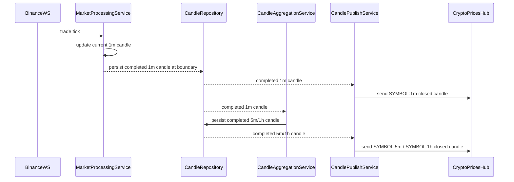

# Crypto Chart Data System Audit

## Context
The platform already has:
- Binance WebSocket trade ingestion
- 1m candle aggregation from trades
- data storage for candles
- logging + hosted service architecture
- a crypto detail page with SignalR live price feed

This audit defines the final production model for crypto chart data: user-controlled interval selection, backend guard rails, and a simple API.

---

## 1. Backend – Data Layer

### Recommended table

1. `Candles`
   - `Id INT PK`
   - `Symbol NVARCHAR(32)`
   - `Source NVARCHAR(16)` — `binance` or `coingecko`
   - `IntervalMinutes INT` — `1`, `3`, `5`, `15`, `60`, `1440`, etc.
   - `OpenTime DATETIME`
   - `CloseTime DATETIME`
   - `Open DECIMAL(18,8)`
   - `High DECIMAL(18,8)`
   - `Low DECIMAL(18,8)`
   - `Close DECIMAL(18,8)`
   - `Volume DECIMAL(28,8)`
   - `CreatedAt DATETIME`
   - Unique index: `(Symbol, Source, IntervalMinutes, OpenTime)`

### Why one table?
- All candles share the same shape.
- `Source` keeps Binance vs CoinGecko separated without extra tables.
- Daily `coingecko` candles are still isolated by `Source='coingecko'` and `IntervalMinutes=1440`.
- This is simpler, easier to maintain, and still production-safe.

### Interval storage
- 1m candles: `Candles`, `Source = 'binance'`, `IntervalMinutes = 1`
- 5m candles: `Candles`, `Source = 'binance'`, `IntervalMinutes = 5`
- 1h candles: `Candles`, `Source = 'binance'`, `IntervalMinutes = 60`
- daily candles: `Candles`, `Source = 'coingecko'`, `IntervalMinutes = 1440`

### Recommended indexes
- `IX_Candles_Symbol_Source_Interval_OpenTime`
- `IX_Candles_Symbol_OpenTime`

### Asset symbol mapping
Add a small mapping table to normalize exchange symbols to CoinGecko IDs:

2. `AssetMappings`
   - `Id INT PK`
   - `Symbol NVARCHAR(32)` — `BTCUSDT`
   - `CoingeckoId NVARCHAR(64)` — `bitcoin`
   - `Source NVARCHAR(16)` — optional for future provider expansion
   - Unique index on `(Symbol, CoingeckoId)`

This mapping is mandatory for CoinGecko backfill and `range=all`.

### Logical partitioning guidance
Treat `Candles` as logically partitioned by symbol + interval. Query always as:
- `WHERE Symbol = @symbol AND Source = @source AND IntervalMinutes = @interval`
- `ORDER BY OpenTime DESC`
- `TAKE N`

Do not use broad `OpenTime BETWEEN` scans for live chart requests. That pattern causes slow queries at scale.

---

## 2. Backend – Data Ingestion

### Binance live path
- Keep existing `BinanceWebSocketService` + `MarketProcessingService`.
- Build 1m candles from live trade ticks.
- On each completed 1m candle:
  - save it to `Candles` as `Source='binance'`, `IntervalMinutes=1`
  - send it to `CandleAggregationService`
- `CandleAggregationService` persists higher-resolution candles.
  - do not compute 5m/1h on request
  - always store 5m and 1h bars in `Candles`
- Treat 1m bars as source of truth for derived intervals.
  - 5m and 1h bars must be reconstructable from 1m history
  - keep raw 1m candles in DB for auditability and reprocessing
- `CandleAggregationService` should produce and persist:
  - 5m candle windows
  - 1h candle windows

### Binance historical backfill
- Use Binance REST `GET /api/v3/klines`
- Backfill 1m candles to `Candles`
- Derive 5m/1h from backfilled 1m bars if needed
- Keep backfill separate from live processing logic

### CoinGecko historical backfill
- Use CoinGecko market chart / range API
- Store daily rows in `Candles` with `Source='coingecko'`, `IntervalMinutes=1440`
- Use only for `range=all`

### Source strategy
- `Binance` = accurate live + short/medium history
- `CoinGecko` = full daily history only
- `Binance` path remains canonical for ranges shorter than `all`
- `CoinGecko` is only for `range=all`

---

## 3. Backend – API Design

### New endpoint
`POST /api/crypto/{symbol}/chart`

Request body:
```json
{
  "range": "14d",
  "interval": "3m",
  "to": "2026-04-29T12:00:00Z"
}
```

### User vs backend control
✔ USER CONTROLLED:
- `range` (how much history)
- `interval` (density/granularity)

✔ BACKEND CONTROLLED:
- max allowed resolution for the requested `range`
- override if the requested interval is too granular

### Guard rails table
This is core safety logic, not a “smart engine”.

| Range | Minimum allowed interval |
|---|---|
| `12h` | `1m` |
| `1d` | `1m` |
| `7d` | `5m` |
| `14d` | `5m` |
| `1y` | `1h` |
| `all` | fixed `1d` |

### Validation flow
1. validate `range`
2. validate requested `interval`
3. if requested interval is finer than allowed, override it
4. if `range == all`, force `interval = 1d`

### Rule
if (`requestedInterval` < `allowedMinIntervalForRange`)
→ override to `allowedMinIntervalForRange`

### Examples
- `range = 14d`, `interval = 3m`
  - allowed min = `5m`
  - result: override → `5m`
- `range = 12h`, `interval = 30m`
  - allowed min = `1m`
  - result: accepted → `30m`
- `range = 1y`, `interval = 1m`
  - allowed min = `1h`
  - result: override → `1h`
- `range = all`, `interval = 5m`
  - result: force → `1d`

### Important principle
Backend does not choose the “best” interval.

Backend only:
- accepts
- or restricts

It does not apply adaptive interval selection or cost-based intelligence.

---

## 4. Fallback interval logic

If the DB does not contain the exact requested interval, use the nearest available interval.

Example:
- requested → `5m`
- available → `30m`, `1h`
- choose nearest available interval

This is the second layer of resilience, not the primary selection mechanism.

---

## 5. API behavior

### Request processing
1. request received
2. validate `range`
3. clamp `interval` with guard rails
4. fallback to closest DB interval if needed
5. query DB
6. return result

### Response shape
```json
{
  "symbol": "BTCUSDT",
  "source": "binance",
  "interval": "5m",
  "range": "14d",
  "candles": [
    {
      "timestamp": "2026-04-29T12:00:00Z",
      "open": 68500.12,
      "high": 68620.00,
      "low": 68300.50,
      "close": 68520.33,
      "volume": 123.45
    }
  ]
}
```

### Selection logic
- validate `symbol` via instrument service
- validate and clamp `interval` using backend guard rails
- query by `Symbol`, `Source`, `IntervalMinutes`, `OpenTime`
- order descending, `Take(limit)`
- return ascending order

### Pagination
- support `to` as the upper bound on `OpenTime`
- fetch rows older than `to`
- this enables chart scrolling without full-range scans

---

## 6. Data Normalization

### Unified candle format
All API responses should use:
- `timestamp` (UTC open time)
- `open`
- `high`
- `low`
- `close`
- `volume`

### Normalization rules
- normalize Binance and CoinGecko sources to a single DTO
- expose `source` and `interval` in the top-level response only
- hide provider-specific raw payload details

### Volume handling
- map CoinGecko volume when available
- if missing, return `0` or `null`

---

## 7. Frontend

### Chart data consumption
- add a chart hook: `useCryptoChart(symbol, range, interval, to)`
- POST request to `/api/crypto/{symbol}/chart`
- normalize response into ascending candle series

### Range + interval selector
- allow user to choose `range`
- allow user to choose `interval`
- show the backend-enforced interval using a badge or label
- cache results per `(symbol, range, interval)`

### Avoid overfetching
- fetch only when symbol/range/interval changes
- keep chart data in local hook state
- do not poll unless live candle updates are required

### Live candle update
- update only the last candle for the current 1m bar via SignalR
- do not refresh full chart on every tick
- keep full history request separate from live updates

---

## 8. Crypto Page (UI)

### Required changes
- add chart area under live summary
- add range selector controls
- add interval selector controls
- display backend-enforced interval and source badge
- keep SignalR live price section intact

### Required state
- `symbol`
- `range`
- `interval`
- `chartData`
- `chartLoading`
- `chartError`
- `effectiveInterval`

### Integration notes
- `CryptoPage` stays as instrument header + live summary
- extend it with chart controls and chart content
- fetch chart data on mount and when `symbol`, `range`, or `interval` changes

---

## 9. Performance + Scaling

### Indexes
- `IX_Candles_Symbol_Source_Interval_OpenTime`
- `IX_Candles_Symbol_OpenTime`

### Query optimization
- filter by `symbol + source + interval`
- sort descending and `Take(limit)`
- project only required candle fields

### Philosophy
- user defines intent (`range` + `interval`)
- backend enforces safe execution constraints
- no ML, no adaptive cost model, no hidden interval selection
- simple, predictable, easy to defend


### Limits
- `30m` → 30–100 rows
- `7d` → max 1500 rows
- `1y` → max 2000 rows
- `all` → max 1000 daily rows

### Caching
- short TTL for live ranges
- longer TTL for `all`
- cache key: `chart:{symbol}:{range}`

---

## 8. Step-by-Step Implementation Plan

1. Extend DB schema
   - add `Source` and `IntervalMinutes` to `Candles`
   - create `AssetMappings`
   - add indexes and logical partition guidance
2. Extend Binance processing
   - keep 1m live generation
   - build `CandleAggregationService` for 5m and 1h
   - persist 5m/1h bars in DB
3. Backfill history
   - Binance REST 1m backfill for 1 year
   - derive 5m/1h from backfilled 1m bars
   - CoinGecko daily backfill for all history using `AssetMappings`
4. Build API
   - implement `GET /api/chart`
   - support `symbol`, `range`, `interval`, `limit`, `to`
   - normalize response DTOs and paginate by `to`
5. Connect frontend
   - add chart component and range switcher to `CryptoPage`
   - use `useCryptoChart`
   - add live 1m candle update via SignalR
6. Validate
   - test each range and source selection
   - verify query pattern `ORDER BY OpenTime DESC` + `TAKE N`
   - validate live candle update behavior
7. Harden
   - monitor chart query latency
   - refresh daily history responsibly

---

## 9. Realization and Deployment

### What will be used
- Backend: .NET 9, ASP.NET Core, EF Core, SQL Server
- Frontend: React + TypeScript, Vite, existing SignalR client
- Existing backend files to extend:
  - `backend/TradingPlatform.Data/Services/Market/BinanceWebSocketService.cs`
  - `backend/TradingPlatform.Data/Services/Market/MarketProcessingService.cs`
  - `backend/TradingPlatform.Data/Repositories/SqlCandleRepository.cs`
  - `backend/TradingPlatform.Data/Context/TradingPlatformDbContext.cs`
  - `backend/TradingPlatform.Api/Controllers/CryptoController.cs`
  - `backend/TradingPlatform.Core/Dtos/CandleDto.cs`
  - `backend/TradingPlatform.Api/Hubs/CryptoPricesHub.cs`
  - `backend/TradingPlatform.Api/Services/PriceUpdatePublisher.cs`
  - `backend/TradingPlatform.Data/Extensions/ServiceCollectionExtensions.cs`
- Frontend files to extend/add:
  - `frontend/src/pages/CryptoPage.tsx`
  - `frontend/src/config/apiConfig.ts`
  - `frontend/src/hooks/useSignalR.ts`
  - `frontend/src/services/SignalRService.ts`
  - `frontend/src/services/MarketDataService.ts`
  - add `frontend/src/hooks/useCryptoChart.ts`
  - add `frontend/src/components/crypto/CryptoChart.tsx`

### Realization plan
1. Add new EF entities:
   - `CandleEntity` extended with `Source` and `IntervalMinutes`
   - represent daily CoinGecko candles in `Candles` using `Source = 'coingecko'` and `IntervalMinutes = 1440`
   - new `AssetMappingEntity`
2. Add migrations in `backend/TradingPlatform.Data/Migrations`
   - update DB schema
   - ensure `Program.cs` still runs `dbContext.Database.Migrate()` on startup
3. Add `CandleAggregationService`
   - persist 5m and 1h bars to `Candles`
   - use completed 1m candles from `MarketProcessingService`
4. Add mapping from exchange symbol to CoinGecko ID
   - store in `AssetMappings`
   - use in CoinGecko backfill and all history requests
5. Add chart API endpoint in `CryptoController`
   - support `symbol`, `range`, `interval`, `limit`, `to`
   - build response DTO with normalized candle structure
6. Extend SignalR path
   - push current 1m candle updates through `CryptoPricesHub`
   - reuse `PriceUpdatePublisher` or add a dedicated candle update publisher
7. Implement frontend chart UI
   - range selector + source badge
   - hook `useCryptoChart`
   - update last candle with live SignalR events

### Deployment notes
- Use existing Docker Compose setup; no new backend service required

---

## 10. Interval-based Publishing Analysis

### Current implementation state
- 1m candles are generated from Binance trades.
- 5m and 1h candles are aggregated and stored in DB.
- SignalR supports interval subscription groups using `symbol:interval`.
- API returns full history via `POST /api/crypto/{symbol}/chart`.
- Frontend loads history first, then opens SignalR.

### Incorrect publish triggers identified
- `MarketProcessingService.ProcessTradeAsync` currently publishes `CandleDto` updates from the open 1m candle on every trade/event.
- This means partial/in-flight 1m candles are emitted, violating the closed-candle-only rule.
- `CandleAggregationService` persists 5m and 1h candles, but does not publish them in a deterministic close-driven way.
- Higher-interval publishing is effectively missing, so the current model is only interval-aware structurally, not behaviorally.
- The SignalR hub naming is correct, but the publish model is not yet strict enough to guarantee only future closed candles.

### Required refactor points
1. `MarketProcessingService`
   - remove direct `PublishCandleUpdateAsync` calls from the in-flight 1m trade path.
   - publish 1m candles only once the minute boundary closes and the candle is persisted.
   - use the persisted closed candle as the publish source.
2. `CandleAggregationService`
   - keep aggregation separate from publish.
   - persist 5m and 1h candles on closed 1m windows.
   - do not publish 5m/1h candles directly from ongoing 1m event processing.
3. Add a deterministic publish scheduler/service
   - publish closed 1m candles at `minute % 1 == 0`.
   - publish closed 5m candles at `minute % 5 == 0`.
   - publish closed 1h candles at `minute == 0`.
   - drive publishing from time boundaries and persisted history, not per-trade events.
4. `PriceUpdatePublisher` / SignalR
   - keep `SYMBOL:interval` group naming.
   - ensure no state is sent immediately on subscription.
   - ensure a single send per finalized closed candle event.
5. Frontend contract
   - treat SignalR as a future-only closed-candle stream.
   - do not expect immediate candle updates on subscribe.
   - do not overwrite the chart with partial in-flight candles.

### Final publishing flow
1. Binance WebSocket receives a trade tick.
2. `MarketProcessingService` updates the current in-memory 1m candle state.
3. When the minute boundary closes:
   a. persist the completed 1m candle to DB.
   b. publish the closed 1m candle to `SYMBOL:1m`.
   c. hand the completed 1m candle to `CandleAggregationService`.
4. `CandleAggregationService` updates 5m / 1h aggregates from persisted 1m history.
5. When a 5m boundary closes:
   a. persist the completed 5m candle to DB.
   b. publish the closed 5m candle to `SYMBOL:5m`.
6. When a 1h boundary closes:
   a. persist the completed 1h candle to DB.
   b. publish the closed 1h candle to `SYMBOL:1h`.
7. SignalR delivers exactly one `ReceiveCandleUpdate` per closed candle to each subscribed group.

### Sequence diagram


### Edge case requirements
- Users subscribing just before close must receive only the next closed candle, not the current partial bar.
- On restart, publishing must recover by using persisted candle boundaries and resume from the last completed candle.
- Missing aggregation windows must be repaired from 1m persisted source before publish.
- Late-arriving trades should be reconciled into persisted closed candles, with publish only after final close.

### Storage consistency
- 5m and 1h candles must always be derived from persisted 1m source data.
- Publishing should use persisted DB rows, not in-memory partial state.
- The DB remains the source of truth for both history and live publish events.

### Performance guidance
- Publish only new closed candles; avoid scanning the full DB on each publish.
- Use lightweight timers or boundary-driven scheduling.
- Avoid N+1 publish loops by batching closed candles per interval boundary when possible.

### First step
Refactor `MarketProcessingService` so 1m candle publishing happens only on minute close, after the completed candle is persisted. Remove any partial in-flight publish call from the trade processing path.

### Deployment notes
- Migration is already applied on startup via `Program.cs`
- Backend container update is enough for schema and API changes
- Frontend update deploys via existing Vite build pipeline
- Ensure Redis remains available for SignalR and existing 2FA flows

### Verification
- Validate `GET /api/chart?symbol=BTCUSDT&range=7d` returns <= 1500 5m candles
- Validate `GET /api/chart?symbol=BTCUSDT&range=all` returns daily CoinGecko rows
- Validate live 1m chart updates when websocket ticks arrive
- Validate history requests use `ORDER BY OpenTime DESC` + `Take(N)`
- Validate symbol mapping works for CoinGecko `bitcoin` vs exchange `BTCUSDT`
